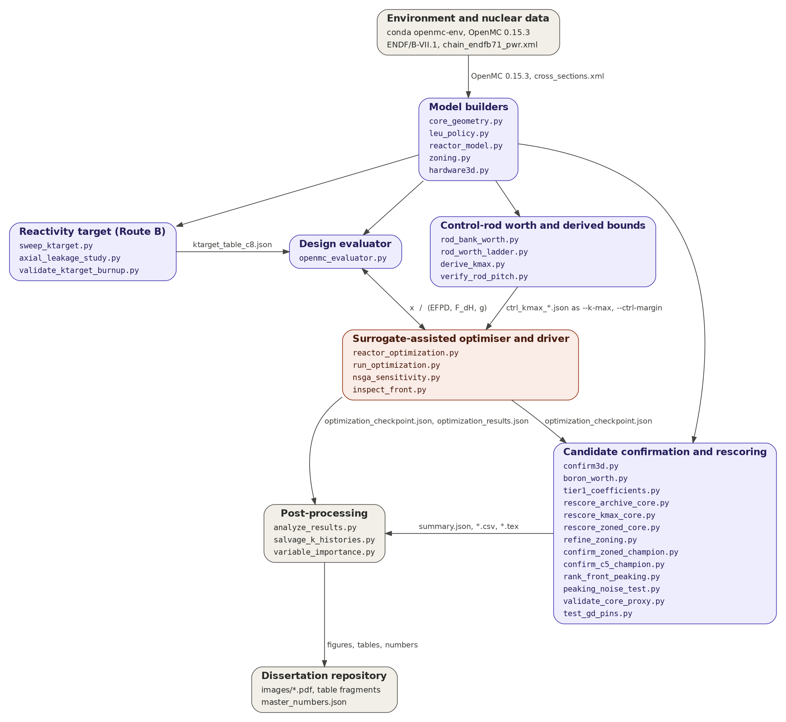

# LABGENE-MOO — Multi-Objective Core Optimization of a LABGENE-Class 48 MWth SMR

Surrogate-assisted multi-objective optimization of the core of a LABGENE
(Laboratório de Geração Nucleoelétrica) -class 48 MWth SMR (Small Modular
Reactor), using OpenMC (Open source Monte Carlo particle transport code) as
the physics evaluator.

MSc thesis in Nuclear Engineering, University of Pisa (UNIPI).
Author: Diôgo Lopes · Advisor: Prof. Giusti

**The optimization problem.** Five design variables — inner enrichment, outer
enrichment, gadolinium weight percent, lattice pitch, reflector thickness —
are searched to simultaneously **maximize cycle length** in EFPD (Effective
Full Power Days) and **minimize the radial power peaking factor F_ΔH**,
subject to a BOL (Beginning Of Life) criticality constraint, the 19.75 wt%
LEU (Low-Enriched Uranium) enrichment cap, a peaking bound, and a vessel-fit
geometric constraint. The loop is: LHS (Latin Hypercube Sampling) DOE (Design
of Experiments) → GP (Gaussian Process) + MLP (Multi-Layer Perceptron)
ensemble surrogate → NSGA-II (Non-Dominated Sorting Genetic Algorithm II)
infill → real OpenMC depletion of the selected designs → checkpoint → resume.

Everything runs inside one Docker container, so a new machine becomes a
~20-minute scripted setup: `git clone` → `bash setup_data.sh` →
`docker build` → run.

---

## 1. Repository contents

<!-- generated by apply_readme_architecture.py -->

The code is organised in nine blocks, drawn in `code_architecture.png`
(generated by `make_architecture_figure.py`, which also prints the tables
below with `--table md`). Only the scripts that compute a physics or
optimisation quantity are listed. Patch scripts (`apply_*.py`, `fix_*.py`,
`repair_*.py`), shell wrappers, figure generators, log parsers and
diagnostics are omitted on purpose. Run
`python make_architecture_figure.py --check` to verify this section
against the tree.



Unlabelled arrows are Python imports. Labelled arrows name the file, or
the pair of vectors, exchanged. The central artefact is
`optimization_checkpoint.json`, written by the optimiser at the end of
every block of iterations and read by every confirmation and
post-processing script.

Environment: conda `openmc-env` (`environment.yml`, `Dockerfile`),
OpenMC 0.15.3, ENDF/B-VII.1 cross sections and `chain_endfb71_pwr.xml`
installed once per machine by `setup_data.sh`, resolved through
`OPENMC_CROSS_SECTIONS` and `OPENMC_CHAIN_FILE`.

### Model builders

| Script | Role | Reads | Writes |
|---|---|---|---|
| `core_geometry.py` | Vessel envelope, geometry margin, end-of-cycle crossing, bilinear interpolation | -- | -- |
| `leu_policy.py` | Enrichment cap and search-box constants shared by all modules | -- | -- |
| `reactor_model.py` | Materials, pin, guide tube, 17x17 assembly and 32-assembly core builders | -- | OpenMC model objects |
| `zoning.py` | Ring map, centre/middle/periphery multipliers, control-bank positions, core BOL solve | -- | OpenMC model objects |
| `hardware3d.py` | Finite-height core with the assembly hardware stack | -- | OpenMC model objects |

### Reactivity target (Route B)

| Script | Role | Reads | Writes |
|---|---|---|---|
| `sweep_ktarget.py` | Tabulates k_target(pitch, t_refl) from assembly and core solves | -- | ktarget_table.json |
| `axial_leakage_study.py` | Axial leakage factor L_ax = k_2D / k_3D on archived designs | optimization_checkpoint.json | axial_<absorber>.json |
| `validate_ktarget_burnup.py` | Burnup dependence of the target on front designs | optimization_checkpoint.json, ktarget_table*.json | summary.json, summary_table.tex |

### Design evaluator

| Script | Role | Reads | Writes |
|---|---|---|---|
| `openmc_evaluator.py` | Design vector to EFPD, F_dH and constraint vector g (assembly depletion, core BOL solve, control solve) | ktarget_table*.json | depletion_results.h5 per case |

### Control-rod worth and derived bounds

| Script | Role | Reads | Writes |
|---|---|---|---|
| `rod_bank_worth.py` | Bank worths and controllability screen of archived designs | optimization_checkpoint.json | banks_<absorber>.json |
| `rod_worth_ladder.py` | Rod-worth ladder and rodded peaking of the zoned core | optimization_checkpoint.json | ladder_idx<i>_<absorber>.json |
| `derive_kmax.py` | Derived k_max ceiling from the minimum bank worth and the margin | banks_<absorber>.json | ctrl_kmax_<group>.json |
| `verify_rod_pitch.py` | Guide-tube clipping study versus pitch | case directories | fig_rod_pitch_*.pdf |

### Surrogate-assisted optimiser and driver

| Script | Role | Reads | Writes |
|---|---|---|---|
| `reactor_optimization.py` | Design space, GP surrogates, NSGA-II acquisition, active-learning loop, checkpoint | -- | optimization_checkpoint.json, optimization_results.json |
| `run_optimization.py` | Command-line driver: DOE, blocks, resume, provenance | ktarget_table*.json, optimization_checkpoint.json | optimization_checkpoint.json, run.log |
| `nsga_sensitivity.py` | Sensitivity of the acquisition step to NSGA-II settings and seeds | optimization_checkpoint.json | nsga_sensitivity.json, .csv, .tex |
| `inspect_front.py` | Census of a live checkpoint: front, screens, per-block diversity | optimization_checkpoint.json | <prefix>_all.csv, <prefix>_front.csv |

### Candidate confirmation and rescoring

| Script | Role | Reads | Writes |
|---|---|---|---|
| `confirm3d.py` | Three-dimensional confirmation of candidates with the hardware stack | optimization_checkpoint.json | runs.json, summary.json |
| `boron_worth.py` | Boron worth and hold-down share across rod states and concentrations | optimization_checkpoint.json | runs.json, summary.json, boron_table.tex |
| `tier1_coefficients.py` | Reactivity coefficients of a candidate | optimization_checkpoint.json | tier1_idx<i>.json |
| `rescore_archive_core.py` | Core-basis peaking of an assembly-basis archive | optimization_checkpoint.json | runs.json, core_rescore.csv |
| `rescore_kmax_core.py` | Re-screens a finished campaign on the core reactivity limits | optimization_checkpoint.json | <label>_kbasis_summary.json |
| `rescore_zoned_core.py` | Transfer test of the zoned loading on an archive | optimization_checkpoint.json | runs.json, zoned_rescore.csv, transfer_summary.json |
| `refine_zoning.py` | Refinement of the ring multipliers of a champion | optimization_checkpoint.json | runs.json |
| `confirm_zoned_champion.py` | Depletion of the zoned champion at full fidelity | optimization_checkpoint.json, ktarget_table*.json | confirm_idx<i>.json |
| `confirm_c5_champion.py` | Feasibility of the Campaign 5 champion at full fidelity | optimization_checkpoint.json | runs.json, summary.json |
| `rank_front_peaking.py` | Minimum-F_dH design beyond Monte Carlo noise (sequential screening) | optimization_checkpoint.json | runs.json, ranking.csv |
| `peaking_noise_test.py` | Seed replicates of F_dH on front designs | optimization_checkpoint.json | noise_summary.csv |
| `validate_core_proxy.py` | Assembly-to-core peaking proxy validation | optimization_checkpoint.json, ktarget_table*.json | runs.json, core_validation.csv |
| `test_gd_pins.py` | Gadolinium pin-count test on a champion (assembly and core) | optimization_checkpoint.json | runs.json, summary.json |

### Post-processing

| Script | Role | Reads | Writes |
|---|---|---|---|
| `analyze_results.py` | Pareto front, hypervolume history, design-space diagnostics | optimization_results.json, optimization_checkpoint.json | fig1..fig5 PNG |
| `salvage_k_histories.py` | Corrects archived depletion histories for the restart defect | optimization_checkpoint.json, depletion_results.h5 | case_<i>_corrected.csv, salvage_summary.csv |
| `variable_importance.py` | Permutation importance of the design variables on the archive | optimization_checkpoint.json | stdout |

---

## 2. Requirements

- Linux, or Windows with WSL2 (Windows Subsystem for Linux 2), or an
  Intel/x86-64 Mac. The environment pins are for linux/amd64;
- Docker Engine (Linux) or Docker Desktop (Windows/macOS):
  https://docs.docker.com/get-docker/
- `git`, `wget`, `tar` (present by default on most Linux systems)
- Disk: ~6 GB for nuclear data, ~4 GB for the Docker image, plus run outputs
- No local Python, conda, or OpenMC installation is needed — and any that you
  already have is not used (see §6)

On Linux, to run `docker` without `sudo` (one time, then log out and back in):

```bash
sudo usermod -aG docker "$USER"
```
- `usermod` — modify a user account
- `-aG docker` — `-a` append (do not replace existing groups), `-G docker`
  add membership to the `docker` group

---

## 3. Installation

### 3.1 Clone the repository

```bash
cd "$HOME"
git clone https://github.com/dcrlopes/master-thesis-unipi.git
cd master-thesis-unipi
```

### 3.2 Download the nuclear data (once per machine, ~2 GB download / ~6 GB on disk)

```bash
bash setup_data.sh
```

This fetches, from the official OpenMC data distribution, into
`~/openmc_data` (pass a different directory as the first argument if you
prefer — see §6 for when you should):

1. the ENDF/B-VII.1 (Evaluated Nuclear Data File, version B-VII.1) HDF5
   cross-section library, and
2. the ENDF/B-VII.1 thermal-spectrum PWR (Pressurized Water Reactor)
   depletion chain, saved as `chain_endfb71_pwr.xml`,

then creates a stable symlink `~/openmc_data/xslib` pointing at the extracted
library folder. The script is resume-safe: re-running it continues an
interrupted download instead of restarting (`wget -c`, where `-c` = continue
partial file).

Verify before continuing:

```bash
readlink "$HOME/openmc_data/xslib"
ls "$HOME/openmc_data/xslib/cross_sections.xml" "$HOME/openmc_data/chain_endfb71_pwr.xml"
```
- `readlink` — print what the symlink points to; it must name the
  ENDF/B-VII.1 folder just extracted (e.g. `endfb-vii.1-hdf5`). If it names
  anything else, see §6.
- the `ls` must list both files without error.

### 3.3 Build the Docker image (~10–15 min, once per machine)

```bash
docker build -t labgene-openmc .
```
- `build` — create an image from the `Dockerfile` in the current directory (`.`)
- `-t labgene-openmc` — tag (name) the image so later commands can refer to it

The image contains the exact conda-forge environment the results were
produced with (OpenMC 0.15.3, Python 3.13, pinned build hashes from
`environment.yml`). The ~6 GB nuclear data is deliberately **not** baked into
the image; it is mounted at run time.

### 3.4 Smoke test — always run this first on a new machine (~minutes)

```bash
docker run --rm -it \
  --user "$(id -u):$(id -g)" \
  -e MPLCONFIGDIR=/tmp/matplotlib \
  -v "$HOME/master-thesis-unipi:/work" \
  -v "$HOME/openmc_data:/data:ro" \
  labgene-openmc \
  python run_optimization.py --smoke --out out_smoke
```
- `run --rm` — start a container, delete it when the command exits (the
  image and your bind-mounted files are untouched)
- `-it` — interactive terminal, so you see live output (drop it for
  unattended runs)
- `--user "$(id -u):$(id -g)"` — run as *your* host user ID and group ID, so
  every file the run writes belongs to you, not to root
- `-e MPLCONFIGDIR=/tmp/matplotlib` — set an environment variable inside the
  container: a writable cache directory for Matplotlib (avoids a harmless
  warning when running as a non-root user)
- `-v A:B` — bind-mount host path A at container path B: the repository
  appears at `/work` (the container's working directory) and the nuclear
  data at `/data`
- `:ro` — the data mount is read-only; the library can never be modified
- `labgene-openmc` — the image built in §3.3
- `--smoke` — a tiny end-to-end run (coarse transport, few designs) that
  exercises the entire chain: build → deplete → extract → surrogate →
  NSGA-II (Non-Dominated Sorting Genetic Algorithm II) → checkpoint → plots
- `--out out_smoke` — write outputs to `out_smoke/` in the repository

Success looks like: the run finishes without errors and
`out_smoke/` contains `optimization_results.json`,
`optimization_checkpoint.json`, and PNG figures.

---

## 4. Running the optimization

### 4.1 The calibration table

Production runs need the end-of-cycle reactivity target table
`ktarget_table.json` — K_TARGET as a function of lattice pitch and reflector
thickness, measured on the full-core model. **The table used for the thesis
campaign is committed in the repository root**, so nothing needs to be done;
`--ktarget-table ktarget_table.json` below simply reads it.

Only if the core geometry is ever changed must it be regenerated
(~2.5–4 h on 32 cores):

```bash
docker run --rm -it \
  --user "$(id -u):$(id -g)" \
  -e MPLCONFIGDIR=/tmp/matplotlib \
  -v "$HOME/master-thesis-unipi:/work" \
  -v "$HOME/openmc_data:/data:ro" \
  labgene-openmc \
  python sweep_ktarget.py --out ktarget_table.json
```
- `--out` — filename of the JSON table to write

Method note: the pipeline uses the "Route B" leakage treatment — depletion
runs at infinite medium and *all* leakage enters through K_TARGET. Do not
combine this table with an explicit reflector in the depletion model, or the
reflector leakage would be counted twice (see the header of
`sweep_ktarget.py`).

### 4.2 A production block (5 active-learning iterations)

```bash
docker run --rm \
  --user "$(id -u):$(id -g)" \
  -e MPLCONFIGDIR=/tmp/matplotlib \
  -v "$HOME/master-thesis-unipi:/work" \
  -v "$HOME/openmc_data:/data:ro" \
  labgene-openmc \
  python run_optimization.py \
    --ktarget-table ktarget_table.json \
    --iters 5 \
    --threads "$(nproc)" \
    --out out \
  2>&1 | tee run1.log
```
- `--ktarget-table` — use the per-design reactivity target interpolated from
  the committed table (§4.1)
- `--iters 5` — run 5 active-learning iterations in this block (each
  iteration = surrogate retrain → NSGA-II — Non-Dominated Sorting Genetic
  Algorithm II — infill → real OpenMC evaluations)
- `--threads "$(nproc)"` — OpenMP (Open Multi-Processing) thread count for
  OpenMC transport; `$(nproc)` expands to the number of CPU cores on your
  machine
- `--out out` — output directory
- `2>&1` — merge the error stream (2) into the output stream (1)
- `| tee run1.log` — show output live *and* save a copy to `run1.log`

A block of this size is a many-hour run on a workstation. For unattended
runs, drop `-it` (as above) and launch inside `tmux` or `nohup` so the run
survives a closed terminal.

### 4.3 Resume — accumulate blocks until convergence

Every run writes a full checkpoint. A later run continues from it, skipping
the initial DOE (Design of Experiments) and retraining the surrogate on all
previously evaluated designs:

```bash
docker run --rm \
  --user "$(id -u):$(id -g)" \
  -e MPLCONFIGDIR=/tmp/matplotlib \
  -v "$HOME/master-thesis-unipi:/work" \
  -v "$HOME/openmc_data:/data:ro" \
  labgene-openmc \
  python run_optimization.py \
    --resume out/optimization_checkpoint.json \
    --ktarget-table ktarget_table.json \
    --iters 5 \
    --threads "$(nproc)" \
    --out out \
  2>&1 | tee run2.log
```
- `--resume PATH` — continue from this checkpoint (the driver warns if
  transport fidelity differs from the checkpoint's, to avoid mixing noise
  levels across sessions)

Stopping rule used in the thesis: HV (Hypervolume) gain below 1% over three
consecutive iterations *and* no censored designs on the Pareto front.

### 4.4 Analyze the results

```bash
docker run --rm \
  --user "$(id -u):$(id -g)" \
  -e MPLCONFIGDIR=/tmp/matplotlib \
  -v "$HOME/master-thesis-unipi:/work" \
  -v "$HOME/openmc_data:/data:ro" \
  labgene-openmc \
  python analyze_results.py \
    --results out/optimization_results.json \
    --checkpoint out/optimization_checkpoint.json \
    --outdir out/fig_analysis
```
- `--results` / `--checkpoint` — the two files every run writes
- `--outdir` — where the figures (Pareto front, HV — Hypervolume — history,
  design-variable maps) are saved

---

## 5. Complete copy-paste quickstart

```bash
# 1. code
cd "$HOME"
git clone https://github.com/dcrlopes/master-thesis-unipi.git
cd master-thesis-unipi

# 2. nuclear data (once per machine)
bash setup_data.sh
readlink "$HOME/openmc_data/xslib"   # must name the ENDF/B-VII.1 folder

# 3. runtime image (once per machine)
docker build -t labgene-openmc .

# 4. smoke test (always, ~minutes)
docker run --rm -it --user "$(id -u):$(id -g)" -e MPLCONFIGDIR=/tmp/matplotlib \
  -v "$HOME/master-thesis-unipi:/work" -v "$HOME/openmc_data:/data:ro" \
  labgene-openmc python run_optimization.py --smoke --out out_smoke

# 5. production block
docker run --rm --user "$(id -u):$(id -g)" -e MPLCONFIGDIR=/tmp/matplotlib \
  -v "$HOME/master-thesis-unipi:/work" -v "$HOME/openmc_data:/data:ro" \
  labgene-openmc python run_optimization.py \
  --ktarget-table ktarget_table.json --iters 5 --threads "$(nproc)" --out out \
  2>&1 | tee run1.log
```


## 6. Troubleshooting

- **Output files owned by root.** Happens only if `--user "$(id -u):$(id -g)"`
  was omitted from a `docker run`. Fix ownership with
  `sudo chown -R "$USER:$USER" .` (`chown` — change owner; `-R` — recurse
  into directories) and include the flag next time.
- **`docker: permission denied` on Linux.** Your user is not in the `docker`
  group yet — run the `usermod` command in §2 and log out/in.
- **`mamba env create` fails during the image build.** A pinned build hash is
  no longer on conda-forge. Edit the Dockerfile's `COPY environment.yml` line
  to `COPY environment.cloud.yml /tmp/environment.yml`, rebuild, then
  re-validate per §7.
- **Interrupted data download.** Just re-run `bash setup_data.sh` — it
  resumes rather than restarting.
- **Long run dies when the terminal closes.** Run it inside `tmux` (terminal
  multiplexer: `tmux new -s opt` to create a session named `opt`; detach with
  Ctrl-b then d; reattach with `tmux attach -t opt`).

---

## 7. Key references

Deb et al. 2002 (NSGA-II —Non-Dominated Sorting Genetic Algorithm II);
Whyte & Parks, PHYSOR 2021 (surrogate-assisted assembly optimization methodological twin); 
The Cambridge civil-marine SMR (Small Modular Reactor) series (Alam, Parks et al.); 
Ez Aldeen et al., J. Nucl. Eng. 2025(NuScale-like benchmark); 
Seurin & Shirvan (MIT reinforcement-learning core loading series); 
Radaideh & Shirvan (NEORL framework).
